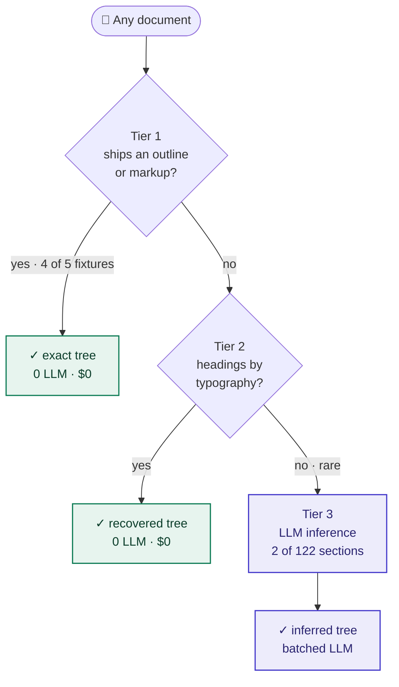

# Marque

**Structure-First RAG · No Vector DB · No Embeddings · No Chunking · 6 Formats · Reproducible Benchmarks**

   

> **Documents already carry their own structure. Marque reads it — and navigates straight to the answer — instead of paying an embedding model or an LLM to reconstruct what the file already contains.**

---

## 📑 Introduction

Retrieval usually starts by *destroying* information. A document arrives with an outline, headings, a table of contents — and the first thing a vector pipeline does is shred it into chunks and hand an embedding model the job of **re-learning** the structure that was right there. Newer "reasoning" RAG systems go one step further, spending hundreds of LLM calls to rebuild a table of contents the PDF already ships in its metadata.

Marque takes the opposite path. It **reads the structure the document already has** — the embedded PDF outline, the Word heading styles, the Markdown `#`s, the HTML tags, the EPUB spine — builds an exact tree in **milliseconds**, and answers by navigating that tree. No vector database to stand up. No embeddings to compute. No chunking to tune. An LLM is a *last resort*, used only for the rare file that genuinely hides its structure — **2 sections out of 122** across our fixtures.

## ⚙️ How It Works — cheapest tier wins

Structure is recovered in tiers, cheapest first. A document exits at the first tier that can read it — and most never reach the LLM:



The three tiers:

| Tier | Method | LLM calls |
|---|---|---|
| **1** | Embedded outline / markup — PDF bookmarks, DOCX styles, Markdown `#`, HTML `<h1>` | **0** |
| **2** | Typography — font size, section numbering, ALL-CAPS | **0** |
| **3** | LLM inference — *only* for what tiers 1–2 cannot resolve | batched, as needed |

Every section is then **verified locally** against its own start page. A mismatch is marked `unverified`, never silently "corrected" — because a confidently-wrong page number is exactly how an index quietly rots.

Retrieval is a **fixed two-call pipeline** — BM25 over the structure → optional LLM selection → a budgeted, citable answer context — never an agent loop that re-sends the whole tree on every turn.

## 🎯 Why Marque

Every other approach **reconstructs** what the document already contains — with an LLM, with embeddings, or with an OCR/layout model. Marque **reads** it. Here's the difference against each alternative, and what it saves you:

| Alternative | How it gets structure | What Marque does instead | What you save |
|---|---|---|---|
| **Vector RAG**<br/><sub>LangChain / LlamaIndex default, or Anthropic Contextual Retrieval</sub> | chunk → embed → vector database | reads the document's own structure | no vector DB, no embeddings, no chunking — and a **measured statistical tie** on retrieval (FinanceBench, QASPER) |
| **PageIndex**<br/><sub>vectorless, the same core idea</sub> | rebuilds the tree with an LLM — ~200–250 calls, ~$1–6/doc <sup>1</sup> | reads the outline the file already ships, verifies locally, **never guesses** | **~$0** indexing · **0 LLM calls** on 4/5 fixtures · **4.4–8.3× fewer** tokens per query |
| **RAPTOR**<br/><sub>hierarchical tree RAG</sub> | clusters + LLM-summarizes chunks, *with embeddings* | uses the document's own tree, no embeddings | a **measured tie** at ~1% of the run cost — **$3** for 150 questions |
| **GraphRAG**<br/><sub>Microsoft</sub> | LLM-builds a knowledge graph across the whole corpus | navigates a single document's structure directly | far cheaper for *"which section answers this?"* (GraphRAG targets corpus-wide sensemaking) |
| **ML parsers**<br/><sub>Unstructured, LlamaParse, Azure Document Intelligence</sub> | OCR / layout ML over the pixels | reads the structure already in the digital file | ~$0 vs per-page ML parsing <sup>2</sup> |

<sub><sup>1</sup> Estimated from PageIndex's MIT source, not a measured figure. &nbsp;·&nbsp; <sup>2</sup> ML parsers still win on **scanned / image-only** PDFs, where Marque needs OCR it doesn't do.</sub>

**The through-line:** for the huge class of digital documents that already carry their structure, you don't rebuild it — you *read* it, exactly and for free, and pay for intelligence only on the genuinely ambiguous remainder.

## 📚 Six formats, one dispatcher

**PDF · Markdown · HTML · DOCX · EPUB · plain text.** Structured-text formats *state* their structure, so they resolve at tier 1 exactly. DOCX and EPUB read through a **zero-dependency ZIP reader** — no libraries pulled in.

```
npm run bench:non-pdf   →   59/59 sections verified · 10 documents · 0 LLM calls · $0
```

## 🌲 The Index

`index()` returns a character-exact tree — sections you can address and retrieve directly, each tagged with how its structure was found and whether it verified:

```json
{
  "doc_name": "attn.pdf",
  "tier": "outline",
  "llm_calls": 0,
  "elapsed_ms": 259,
  "structure": [
    { "title": "Introduction", "node_id": "0000", "pages": [2, 2], "verification": "verified" },
    { "title": "Model Architecture", "node_id": "0002", "pages": [2, 5],
      "nodes": [
        { "title": "Attention", "node_id": "0004", "pages": [3, 5], "verification": "verified" }
      ]
    }
  ]
}
```

## 🧪 Quick Start

```bash
npm install marque-rag
```

```bash
# index and inspect any document's structure
node bin/cli.mjs report.pdf

# ask a question
node bin/cli.mjs report.pdf --query "how is attention computed?"
```

```js
import { index, query, createLLM } from 'marque-rag';

const doc = await index('report.docx');                       // PDF · MD · HTML · DOCX · EPUB · TXT
const { answer, sections } = await query(doc, 'what were the FY revenue figures?', {
  llm: createLLM(),                                           // optional — BM25 works with zero LLM
});
```

## 📈 Benchmarks — measured, with confidence intervals, and reproducible

Marque is benchmarked *honestly* — against a **fully-tuned** contextual-embedding vector stack, with significance tests and gold-standard evidence, not a strawman:

- **Structure extraction** — 4 of 5 fixtures resolve at **tier 1, zero LLM calls**; where a document ships no outline, tier-2 typography recovers most of it. Deterministic, $0. *(`bench:structure-accuracy`)*
- **Retrieval** — the right section lands in the shortlist **17/17 (100%)** on the labelled eval, BM25 only, zero LLM; an optional one-call re-rank lifts top-4 selection to **16/17**. *(`npm run eval`)*
- **Query cost** — a fixed two-call pipeline uses **4.4–8.3× fewer input tokens per question** than an agentic tree-RAG that re-sends the tree and every fetched page each turn. *(`npm run bench`)*
- **FinanceBench** *(strict end-to-end QA, third-party grader)* — structure-first is **statistically indistinguishable from the tuned vector baseline** (McNemar *p* = 0.15) and **tied with RAPTOR** (*p* = 0.77), stable across runs. *(`bench:significance`)*
- **QASPER** *(prose, scored on gold evidence paragraphs — no LLM judge)* — **ties the vector baseline at recall@5** (77.9% vs 79.6%), with **no embeddings**. *(`bench:qasper`)*

Every figure regenerates from a script in [`bench/`](bench/), with methodology and caveats in each `bench/*/README.md`. We don't publish a number we can't reproduce.

> **The honest boundary:** on table-heavy financial figures, a tuned vector stack still has the edge in absolute terms — we report a *tie*, not a win, and that restraint is what makes the rest credible. What Marque removes is the vector database, the embeddings, the chunking, and the indexing bill — while matching the retrieval quality.

## 🧭 Design principles

1. **Cheapest tier that works, wins.** An LLM call is a failure of the tiers below it, not the default path.
2. **Never guess.** Unresolvable structure is marked `unverified`, never silently corrected — caught by an adversarial test before we trusted the guard.
3. **No agent loop.** Retrieval is a fixed two-call pipeline; re-sending the tree every turn is the single largest cost term in agentic RAG.

**Deep dive:** the three verification states, the tier-3 adjudication rules, the retrieval internals, and the full measured tables (including the query-cost breakdown) are in **[docs/DESIGN.md](docs/DESIGN.md)**.

## ⚠️ Known gaps

- **Scanned PDFs** with no text layer need OCR — not handled.
- **One document at a time** — no multi-document routing yet.
- The query-cost comparison **models** an agentic tree-RAG's payload from its published source, not an instrumented end-to-end run; Marque's own side is measured live.

## 📄 License

MIT. See [`bench/`](bench/) for the full methodology behind every number above.
